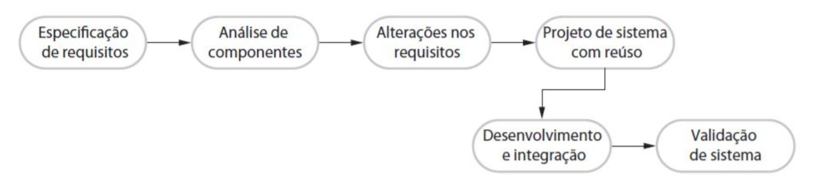

# Segunda Lista Projeto e Engenharia de Software

1. Explique por que o desenvolvimento incremental é o método mais eficaz para o desenvolvimento de sistemas de software de negócios. Por que esse modelo é menos adequado para a engenharia de sistemas de tempo real ?

2. Considere o modelo de processo baseado em reúso da Figura abaixo. Explique por que, nesse processo, é essencial ter duas atividades distintas de engenharia de requisitos.
  

        Em um modelo de processo com um foco em reaproveitamento de código como um
        desenvolvimento de um framework por exemplo, é comum ter uma etapa durante
        o desenvolvimento onde a equipe busca encontrar padrões entre os componentes,
        verificar se se criação de novos componentes é algo necessário ou se pode rea-
        proveitar um componente já criado, nesse tipo de modelo, mitigar qualquer modi-
        ficação da arquitetura do software é normalmente tão importante quando gerar o
        software que atenda os requisitos. Em desenvolvimento de um framework ter um
        passo para analisar a arquitetura ajuda a reduzir o número de breaking changes
        que uma nova realise do seu software pode conter.

3. Descreva as principais atividades do processo de projeto de software e as saídas dessas atividades.

4. Explique por que os sistemas desenvolvidos como protótipos normalmente não devem ser usados como sistemas de produção.

            Um protótipo possui o objetivo, validar uma ídeia e demonstrar o
            funcionamento dela, o autor do protótipo possui a liberdade de não
            se preocupar com as boas práticas de desenvolvimento durante a cria-
            ção do protótipo, caso opte por essa abordagem, muito provavélmente
            inserir novas funcionalidades ou a manutenção dessa aplicação serão
            praticamente inviáveis e não é recomendado por em produção, um soft-
            ware com a manutenção e a inserção de novas features comprometidas.  

5. Quais são as vantagens de proporcionar visões estáticas e dinâmicas do processo de software, assim como no Rational Unified Process ?

6. Por que métodos como o Processo Unificado (UP) e Espiral não são considerados ágeis? E qual a diferença deles para o Modelo Waterfall ?

7. Historicamente, a introdução de tecnologia provocou mudanças profundas no mercado de trabalho e, pelo menos temporariamente, deixou muitas pessoas desempregadas. Discuta se a introdução da automação extensiva em processos pode vir a ter as mesmas consequências para os engenheiros de software. Se sua resposta for não, justifique. Se você acha que sim, que vai reduzir as oportunidades de emprego, é ética a resistência passiva ou ativa, pelos engenheiros afetados, à introdução dessa tecnologia ?

    Sim ou não ambos estão certos. A figura da automação sem
    contexto especifico pode proporcionar o bem estar, melhor a qualidade de vida, melhor
    qualidade do trabalho e mais empregos na área de desenvolvimento de software como também
    pode ser utilizado para nós prejudicar. Um exemplo positivo
    podemos citar o desenvolvimento de ferramentas que verificação a qualidade do código
    testado com o [codecov](https://codecov.io/) ou outras ferramentas de DevOps. Um exemplo
    negativo foi a utilização de [inteligencia artificial para a automação de seleção de currículos pode ser sexista](https://olhardigital.com.br/2018/10/10/noticias/inteligencia-artificial-da-amazon-exercitava-preconceito/). (Utilização de engenheiros de software em seleções de empregos na sua respectiva área é uma prática muito comum).

    __OBS:__ se você está com medo de uma certa IA programando, significa que você é um péssimo programador e eu não gosto de você (como programador).
