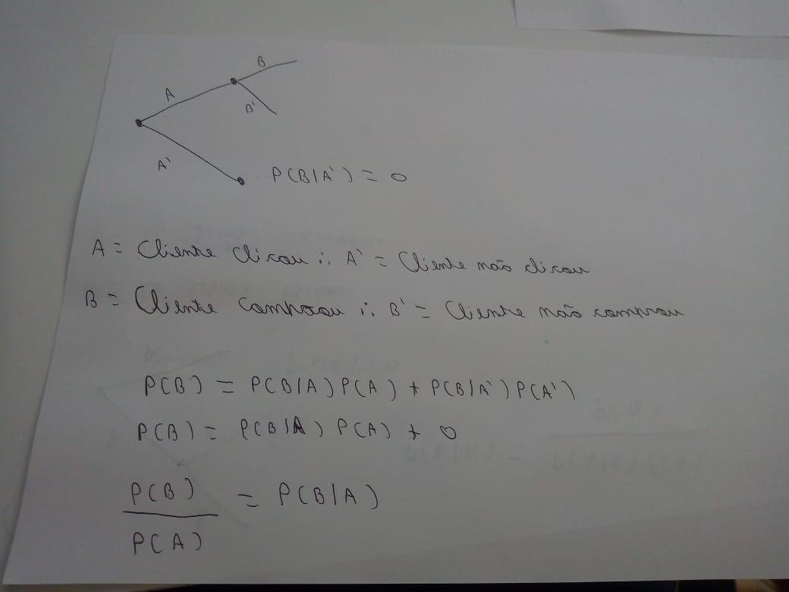

# Quarta Lista Engenharia de Requisitos

## 1. [POSCOMP 2010, adaptado] Sobre Engenharia de Requisitos, marque Verdadeiro (V) ou Falso (F)

 (V) A Engenharia de Requisitos, como todas as outras atividades de Engenharia de
Software, precisa ser adaptada às necessidades do processo, do projeto, do produto e
do pessoal que está fazendo o trabalho.

(V) No estágio de levantamento e análise dos requisitos, os membros da equipe técnica
de desenvolvimento do software trabalham com o cliente e os usuários finais do
sistema para descobrir mais informações sobre o domínio da aplicação, que serviços
o sistema deve oferecer, o desempenho exigido do sistema, as restrições de hardware,
dentre outras informações.

(F) Na medida em que a informação de vários pontos de vista é coletada, os requisitos
emergentes são consistentes.

(V) A validação de requisitos se ocupa de mostrar que estes realmente definem o
sistema que o cliente deseja. Ela é importante porque a ocorrência de erros em um
documento de requisitos pode levar a grandes custos relacionados ao retrabalho.

## 2. Cite o nome de pelo menos cinco técnicas para elicitação de requisitos

entrevistas com stakeholders, questionários, formulários, implementação protótipos, interação
com o ambiente de trabalho dos stakeholders (técnicas etnográficas).

## 3. Quais são as três partes de uma história de usuário? Responda usando o acrônimo 3C's

- **C**artão, uma mini estória contada informalmente com **poucas sentenças** que expressão
uma funcionalidade do sistema.

- **C**onversas, no desenvolvimento ágil se presa mais por comunicação verbal do que escrita,
durante as constantes conversas com o representando do cliente é que se resolve ambiguidades
e se obtém detalhes que não estão presentes no cartão. **OBS: o presentante do cliente participa em tempo integral com time**, Caso não seja possível essa interação com o time,
ágil deixa de ser tão interessante. Sem farpas, apenas a true da true.

- **C**omfirmação, o teste final de uma estória de usuário é o cliente aceitar a solução
proposta no time de desenvolvimento, geralmente se utiliza de cenários exemplos que confirme
o comportamento desejado pela solução proposta.

## 4. Suponha uma rede social como o Facebook. (1) Escreva um conjunto de cinco histórias para essa rede, assumindo o papel de um usuário típico; (2) Pense agora em mais um papel de usuário e escreva pelo menos duas histórias para ele

1. - O usuário entra no site [facebook.com](https://www.facebook.com/), como ele já tem uma conta, ele insere o seu Email ou telefone e sua senha e clica em entrar para ter acesso a sua conta.

   - O usuário entra no site [facebook.com](https://www.facebook.com/), mas ele não tem uma
conta, então ele clicar em criar nova conta, inserir suas informações: nome,
sobrenome, email ou celular, uma senha, data de nascimento e seleciona seu gênero.

   - O usuário entra no site [facebook.com](https://www.facebook.com/), apesar de ter uma
conta, ele esqueceu a senha, então ele clica em esqueceu a senha e sistema fica encarregado de
enviar uma solicitação de nova senha para o e-mail dele ou para o celular.

   - O usuário entra no site [facebook.com](https://www.facebook.com/) e como ele já se
acessou sua conta nesse dispositivo, então ele acessa a sua conta automaticamente.

   - O sistema monitora regularmente o usuário e percebe que ele está pouco engajado na rede
social, logo o sistema começa a enviar notificações das fotos dos amigos usuário sem
os seus amigos marcarem ele.

## 5. Pense em um sistema e escreva uma história épica para o mesmo

Tenho que buscar as minhas compras que chegaram no carro, pois ele não tem motorista.

## 6. No contexto de requisitos, o que significa a expressão gold plating ?

**gold plating**, é uma melhoria no sistema que **não gera valor** para o cliente. Um fato interessante no desenvolvimento de software, é que em um dado momento o sistema pode de certa
forma "pedir" uma melhoria, mas sábios são aqueles que conseguem diferenciar melhorias que
agregam do **gold plating**.

## 7. Escreva um caso de uso para um Sistema de Controle de Bibliotecas

Renovar empréstimo de um livro

Ator: Cliente da biblioteca

Fluxo normal:

1 - Autenticar Cliente.

2 - Cliente informa que quer renovar um empréstimo.

3 - Ciente informa o livro que deseja renovar o empréstimo.

4 - Sistema efetua a renovação.

5 - Sistema pergunta se o cliente deseja renovar outro empréstimo.

Extensões:

2a - Se ele não tiver livros emprestados, avisar ao cliente não tem livros emprestados.

3a - Se não for possível renovar o empréstimo do livro, enviar o motivo de poder renovar.

4a - Data informada deve ser a data atual ou no máximo um ano a frente.

5a - se não tiver mais livros possíveis de serem renovados, redirecionar o cliente para a página principal.

## 9. O seguinte caso de uso possui apenas o fluxo normal. Escreva então algumas extensões para ele

Comprar Livro  
Ator: Usuário da loja virtual  

Fluxo normal:

1 - Usuário pesquisa catálogo de livros  
2 - Usuário seleciona livros e coloca no carrinho de compra  
3 - Usuário decide fechar a compra  
4 - Usuário seleciona endereço de entrega  
5 - Usuário seleciona tipo de entrega  
6 - Usuário seleciona modo de pagamento  
7 - Usuário confirma pedido  

Extensões:

1a - Se não encontrar nenhum livro, informar o motivo e mostrar livros recomendados  
3a - O sistema verifica se o cliente está autenticado e pede a autenticação  
3b - O sistema verifica se existe os livros no estoque, caso não exista, informe ao cliente
que acabou o estoque do livro ou dos livros selecionados  
4a - Sistema verifica se o cliente tem algum endereço cadastrado, caso não tenho pedir ao cliente que informe um endereço.  
7a - Sistema verifica o comportamento de navegação do cliente, caso for suspeito, ligar
para o cliente

## 10. Qual a diferença entre um Produto Mínimo Viável (MVP) e o produto obtido na primeira iteração de um método ágil, como XP ou Scrum ?

Um MVP é um protótipo que possui uma única responsabilidade: demonstrar que um determinado produto é viável o mais breve possível, portanto é comum acoplar funcionalidades, abdicar de
desdes unitários e outras boas práticas para atingir o seu objetivo. Já o produto obtido na
primeira iteração de um método ágil, apesar de também poder ser considerado um protótipo,
ele está razoávelmente organizado e testado ao ponto que é possível adicionar novas features ou modificar as existêntes sem que essas alterações modifique ou modifique pouco as outras
features do sistema.

## 11. Quando começou, a EasyTaxi — a empresa brasileira de aplicativos para solicitação de táxis — construiu um MVP que usava um software muito simples e uma parte operacional realizada de forma manual. Pesquise na Internet sobre esse MVP (basta usar as palavras EasyTaxi e MVP) e faça uma descrição do mesmo

O MVP do EasyTaxi era um formulário em blog, onde o cliente inseria informações
de endereço, nome e telefone que eram enviados para o e-mail de Tallis (Fundador do easyTaxi)
onde ele mesmo buscava no Google o taxi mais próximo e após 10 minutos ele ligava para o
taxista e verificava se ouve o embarque.

## 12. Suponha que estamos em 2008, quando ainda não existia Spotify, e você decidiu criar uma startup para oferecer um serviço de streaming de músicas na Internet. Então, como primeiro passo, você implementou um MVP

### Quais seriam as principais funcionalidades desse MVP ?

Ouvir funk

### Ele seria desenvolvido para qual hardware e sistema operacional ?

Todo hardware que fosse possível entrar em um site

### Elabore um rascunho rápido da sua interface com o usuário

### Quais métricas você usaria para medir o sucesso/fracasso do MVP ?

Eu iria mostrar isso para os Djs do morro, colocava todas as músicas que eles
pedissem, e verificaria se eles usariam o site ao invés do pendrive e escutaria
as queixas deles. (atualmente eu moro no Rio de Janeiro capital)

## 13. Suponha que você seja responsável por um sistema de comércio eletrônico. Suponha que na versão atual desse sistema (versão A) a mensagem do carrinho de compra seja: "Adicionar ao Carrinho". Suponha que você pretenda fazer um teste A/B testando a mensagem alternativa: "Compre Já", a qual vai corresponder à versão B do teste

### Qual seria a métrica usada como taxa de conversão nesse teste ?

- Uma aproximação para P(A) seria:
(o número de cliques que um usuário fez) / (número total de usuários).
- Uma aproximação de P(B) seria:
(o número de usuários que compraram / (número total de usuários).
- A métrica usada sera P(B|A), que significa: probabilidade do cliente que comprou dado
que ele comprou.

### Supondo que no sistema original a taxa de conversão seja de 5% e que você deseja avaliar um ganho de 1% com a mensagem da versão B, qual seria o tamanho da amostra que deveria testar em cada uma das versões? Para responder, use uma calculadora de tamanho de amostras de testes A/B, como aquela que citamos na ​ [Seção 3.6 do livro “Engenharia de Software Moderna: Princípios e Práticas para Desenvolvimento de Software com Produtividade”](https://engsoftmoderna.info/cap3.html)

Considerando um &sigma; de 95%, é necessário uma amostra de 4,700,000.

calculo realizado pela site [optimizely.com/sample-size-calculator](https://www.optimizely.com/sample-size-calculator/?conversion=5&effect=1&significance=95)
